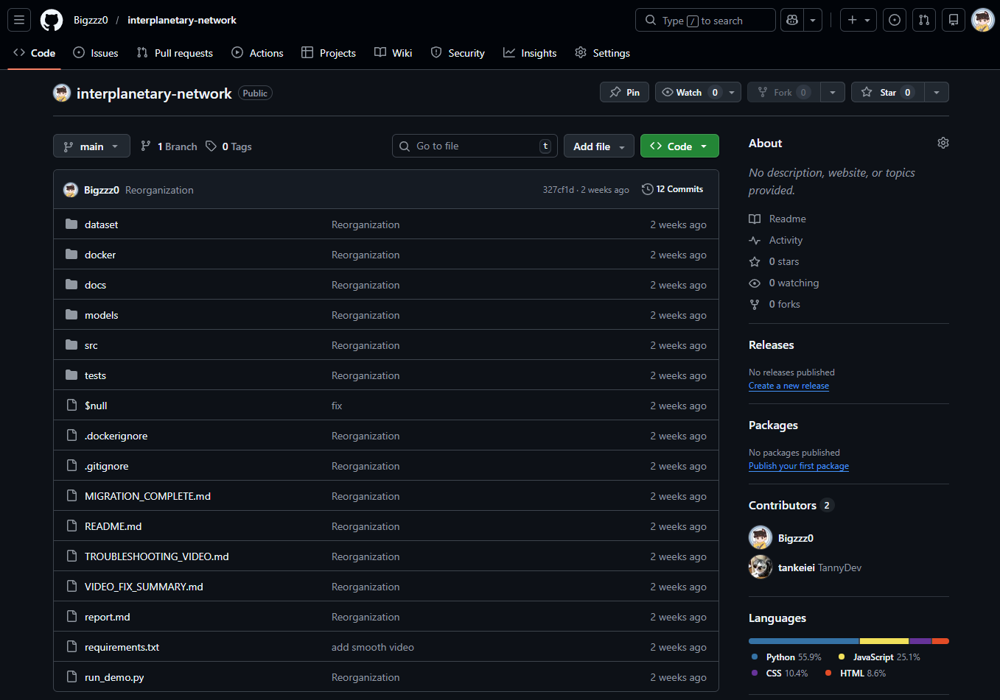
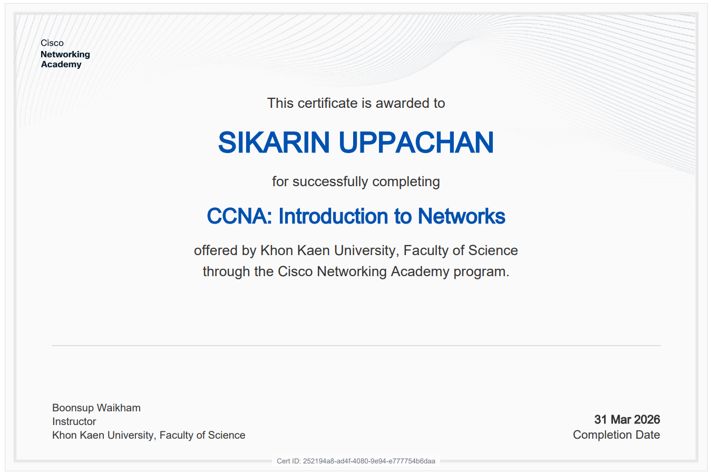
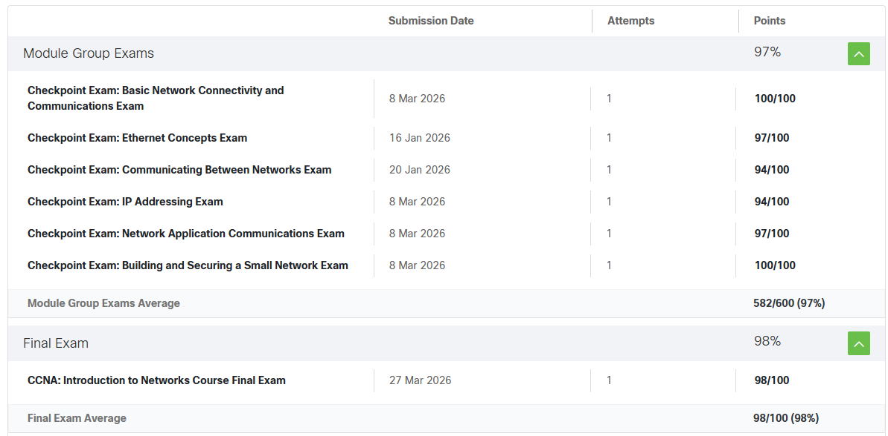

<div align="center">


# 🌐 Network Portfolio


<br/>

[](https://python.org)
[](https://www.netacad.com/)
[](https://www.wireshark.org/)
[](https://github.com/Bigzzz0)
[](https://code.visualstudio.com/)

<br/>


<br/>

> 👤 **นายศิฆรินทร์ อุปจันทร์** &nbsp;·&nbsp; รหัส `673380292-5` &nbsp;·&nbsp; Section 01
>
> 📧 [sikarin.u@kkumail.com](mailto:sikarin.u@kkumail.com) &nbsp;·&nbsp; 💼 [github.com/Bigzzz0](https://github.com/Bigzzz0) &nbsp;·&nbsp; 🎓 [Khon Kaen University](https://www.kku.ac.th/)

</div>

<br/>

---

## 📖 About This Portfolio

> 🗂️ พอร์ตฟอลิโอนี้รวบรวมผลงานตลอดภาคเรียนจากวิชา **Computer Networks** และ **Network Programming** ที่มหาวิทยาลัยขอนแก่น
> ครอบคลุมตั้งแต่ทฤษฎีพื้นฐาน OSI/TCP-IP, การออกแบบเครือข่าย, ไปจนถึงการเขียนโปรแกรมเครือข่ายขั้นสูง
> และจบด้วย Final Project จำลองระบบสื่อสารระหว่างดาวเคราะห์ 🪐

| 🌐 Computer Networks | 💻 Network Programming |
|:---------------------|:----------------------|
| ├─ Network Fundamentals / OSI | ├─ TCP / UDP Socket Programming |
| ├─ TCP/IP Protocol Suite | ├─ Broadcast & Multicast |
| ├─ IP Addressing / Subnetting | ├─ Peer-to-Peer Networks |
| ├─ Routing & Switching | ├─ Ad-Hoc & MANET |
| └─ Network Security Basics | ├─ Store-and-Forward / DTN |
| | └─ Bio-Inspired Routing |

<div align="center">

[](https://github.com/Bigzzz0)

[](https://github.com/Bigzzz0)

> 📌 *GitHub Stats cards render on GitHub.com — [View live →](https://github.com/Bigzzz0/Network_Portfolio)*

</div>

---

## 🗂️ Table of Contents

| # | Section | Description |
|:-:|---------|-------------|
| 1 | [📄 Personal Assignments](#-personal-assignments) | รายงานส่วนตัว — ทฤษฎีและการออกแบบเครือข่าย |
| 2 | [🧪 Labs (1–5)](#-labs-15) | Lab reports จาก Cisco Networking Academy |
| 3 | [💻 Network Programming (Week 1–9)](#-network-programming-week-19) | โปรแกรมเครือข่าย 9 สัปดาห์ด้วย Python |
| 4 | [🚀 Final Project](#-final-project) | Interplanetary Network Simulation |
| 5 | [📜 Certificates](#-certificates) | ใบประกาศนียบัตรจาก Cisco NetAcad |
| 6 | [📝 Checkpoint Exams](#-checkpoint-exams) | คะแนนสอบ — เฉลี่ย 97% |
| 7 | [🎯 Skills Summary](#-skills-summary) | ทักษะที่ได้รับตลอดภาคเรียน |

---

## 📄 Personal Assignments

> รายงานส่วนตัวจากวิชา **Computer Networks** ครอบคลุมทั้งทฤษฎีและการออกแบบเครือข่ายจริง

| # | 📝 Assignment | 📌 Topic | 🔗 Link |
|:-:|:--------------|:---------|:-------:|
| 1 | **Personal Essay** | Introduction to Networks & Personal Background | [📄 View](https://docs.google.com/document/d/1UdnPptzAWEGAKyV7Sy6vPeXuqEH_WvDD3vjPayKQS6I/edit?usp=sharing) |
| 2 | **Assignment 2** | Network Topology Design | [📄 View](https://docs.google.com/document/d/1KUTVyKYmWqy9I9e5S-JPk3-6Lm6up8fsoCqR1VV6rig/edit?usp=sharing) |
| 3 | **Assignment 3** | Complex Network Design | [📄 View](https://docs.google.com/document/d/1FP2UyyUu7fEkvNRhVb3NP-Oztyfwb4m0lu2WlBSIJQ0/edit?usp=sharing) |
| 4 | **Assignment 4** | TCP vs UDP Analysis | [📄 View](https://docs.google.com/document/d/15gTiubcpzYbxnXS-7bI2qQ8DVmliWbwZp8M3S7UHPZs/edit?usp=sharing) |

---

## 🧪 Labs (1–5)

> Lab reports จาก **Cisco Networking Academy** ฝึกปฏิบัติด้วย Cisco Packet Tracer 🖥️

| # | 🔬 Lab | 📌 Topic | 🛠️ Skills Practiced | 📄 Report |
|:-:|:-------|:---------|:--------------------|:---------:|
| 1 | **Lab 1** | Network Basics | `Subnetting` `Topology Design` | [View](https://docs.google.com/document/d/1oqGtlcZ23RfcoAmh7J8UIyy4ez55hrun_UrntW8NqAg/edit?usp=sharing) |
| 2 | **Lab 2** | VLAN Design | `VLAN` `Trunking` `802.1Q` | [View](https://docs.google.com/document/d/1bFA9APAwBCsOpFJhOlSNbxDys74AXxjFP4qOcadhXrc/edit) |
| 3 | **Lab 3** | Router-on-a-Stick | `Inter-VLAN Routing` `Subinterface` | [View](https://docs.google.com/document/d/1f4ruHR8qC6pV63fiCZ2uI9psKrLqej3c8NhWxdt11gA/edit?usp=sharing) |
| 4 | **Lab 4** | Stateful vs Stateless | `Service Architecture` `Protocol Design` | [View](https://docs.google.com/document/d/1IFeSFYEjTHPoRWvstWsnvtbRHp8uLUmtbv5R79g6G7k/edit) |
| 5 | **Lab 5** | Advanced Configuration | `Routing Protocols` `OSPF` | [View](https://docs.google.com/document/d/1S5N9W2macoUa047YxNgecGuPtwXni2xlMV3vQlu78FM/edit) |

---

## 💻 Network Programming (Week 1–9)

> โปรแกรมเครือข่ายทั้งหมดพัฒนาด้วย **Python** 🐍 ครอบคลุม 9 สัปดาห์
> ตั้งแต่ TCP/UDP พื้นฐาน จนถึง Bio-Inspired Routing Algorithm ขั้นสูง

| Week | Protocol | 📌 Topic | 💡 Key Concept | 📓 Notes |
|:----:|:--------:|:---------|:---------------|:--------:|
| `W01` |  | TCP Client-Server | 3-Way Handshake, Blocking I/O | [📝](NetworkProgramming9Week/week01-tcp-client-server/what-i-learned-week01-tcp.md) |
| `W02` |  | UDP Unicast | Connectionless, Low-latency tradeoff | [📝](NetworkProgramming9Week/week02-udp-unicast/what-i-learned-week02-udp.md) |
| `W03` |  | Broadcast | One-to-many LAN messaging | [📝](NetworkProgramming9Week/week03-broadcast/what-i-learned-week03-broadcast.md) |
| `W04` |  | Multicast | IGMP, Group membership | [📝](NetworkProgramming9Week/week04-multicast/what-i-learned-week04-multicast.md) |
| `W05` |  | Peer-to-Peer | Decentralized, Symmetric roles | [📝](NetworkProgramming9Week/week05-p2p/what-i-learned-week05-p2p.md) |
| `W06` |  | Ad-Hoc (MANET) | Mobile networks, Probabilistic forwarding | [📝](NetworkProgramming9Week/week06-adhoc-manet/what-i-learned-week06-adhoc.md) |
| `W07` |  | Store-and-Forward | Message queuing, Delay-tolerant | [📝](NetworkProgramming9Week/week07-store-forward/what-i-learned-week07-store-forward.md) |
| `W08` |  | Opportunistic Routing | Probability-based path selection | [📝](NetworkProgramming9Week/week08-opportunistic/what-i-learned-week08-opportunistic.md) |
| `W09` |  | Bio-Inspired Routing | Ant Colony / Pheromone algorithm | [📝](NetworkProgramming9Week/week09-bio-inspired/what-i-learned-week09-bio.md) |

### 📂 Repository Structure

```
NetworkProgramming9Week/
├── week01-tcp-client-server/    # 🔵 TCP Socket basics & 3-way handshake
├── week02-udp-unicast/          # 🟠 UDP connectionless communication
├── week03-broadcast/            # 🟠 LAN broadcasting (255.255.255.255)
├── week04-multicast/            # 🟠 Group multicast with IGMP
├── week05-p2p/                  # 🟣 Peer-to-peer file sharing
├── week06-adhoc-manet/          # ⚫ Mobile Ad-Hoc Network simulation
├── week07-store-forward/        # 🟤 Delay-Tolerant Networking (DTN)
├── week08-opportunistic/        # ⚫ Opportunistic routing algorithm
└── week09-bio-inspired/         # 🐜 Ant Colony Optimization routing
```

<div align="center">

[](https://github.com/Bigzzz0)

</div>

---

## 🚀 Final Project

<div align="center">

### 🪐 Interplanetary Network Simulation

[](https://github.com/Bigzzz0/interplanetary-network)
&nbsp;
[](https://python.org)

</div>

> 🌌 จำลองระบบเครือข่ายสำหรับการสื่อสารระหว่างดาวเคราะห์ที่มีค่า **delay สูงระดับนาที–ชั่วโมง** และ **link ไม่เสถียร**
> ประยุกต์ใช้ **Delay-Tolerant Networking (DTN)** ร่วมกับ **Store-and-Forward** เพื่อรับประกันการส่งข้อความ



**✨ Key Features**

| Feature | Description |
|:--------|:------------|
| 🪐 **Delay-Tolerant Networking** | รองรับ propagation delay ระดับนาทีถึงชั่วโมง |
| 📡 **Store-and-Forward** | เก็บข้อมูลในโหนดไว้รอจนกว่า link จะพร้อม |
| ⏱️ **Realistic Delay Simulation** | จำลอง signal propagation delay ตามระยะทางจริง |
| 🔧 **Custom Protocol Design** | ออกแบบ protocol เฉพาะสำหรับ interplanetary communications |
| 🔄 **Multi-hop Routing** | ส่งข้อมูลผ่านหลาย relay node ระหว่างดาวเคราะห์ |

**🛠️ Tech Stack**


---

## 📜 Certificates

<div align="center">

### 🏅 Cisco Networking Academy

#### CCNA: Introduction to Networks



[](https://www.netacad.com/)

</div>

---

## 📝 Checkpoint Exams

<div align="center">

> 🎯 คะแนนสอบจาก **Cisco Networking Academy** — CCNA: Introduction to Networks



</div>

### 📊 Module Group Exams

<div align="center">


&nbsp;&nbsp;


</div>

| 📋 Exam | 📅 Date | 🏆 Score |
|:--------|:-------:|:--------:|
| Basic Network Connectivity and Communications Exam | 8 Mar 2026 | **100/100** 🥇 |
| Ethernet Concepts Exam | 16 Jan 2026 | **97/100** ✅ |
| Communicating Between Networks Exam | 20 Jan 2026 | **94/100** ✅ |
| IP Addressing Exam | 8 Mar 2026 | **94/100** ✅ |
| Network Application Communications Exam | 8 Mar 2026 | **97/100** ✅ |
| Building and Securing a Small Network Exam | 8 Mar 2026 | **100/100** 🥇 |

### 🎓 Course Final Exam

<div align="center">


</div>

| 📋 Exam | 📅 Date | 🏆 Score |
|:--------|:-------:|:--------:|
| CCNA: Introduction to Networks — Course Final Exam | 27 Mar 2026 | **98/100** 🏆 |

---

## 🎯 Skills Summary

### 🛠️ Technical Skills

| Category | 🔧 Skills |
|:---------|:---------|
| **Network Fundamentals** | `OSI 7-Layer` `TCP/IP Suite` `IPv4/IPv6 Addressing` `Subnetting` |
| **Socket Programming** | `TCP Sockets` `UDP Sockets` `Multi-threaded Servers` `Broadcast` `Multicast` |
| **Network Design** | `VLAN` `Router Configuration` `Cisco Packet Tracer` `Topology Design` |
| **Advanced Networking** | `MANET` `Store-and-Forward DTN` `Opportunistic Routing` `Bio-Inspired Algorithms` |
| **Tools & Platforms** | `Wireshark` `Git & GitHub` `VS Code` `Python` `Cisco NetAcad` |

### 📈 Proficiency Level

| Skill | Level | Progress |
|:------|:-----:|:--------:|
| TCP/UDP Socket Programming | `Advanced` |  |
| Network Design (Cisco PT) | `Proficient` |  |
| VLAN & Routing | `Proficient` |  |
| Delay-Tolerant Networking | `Intermediate` |  |
| Bio-Inspired Algorithms | `Intermediate` |  |

### 🌱 Soft Skills Developed

| Skill | How It Was Applied |
|:------|:------------------|
| 🔍 **Problem Solving** | Debug network and socket issues under real constraints |
| 📊 **Analytical Thinking** | Network traffic analysis with Wireshark |
| 📝 **Technical Writing** | Weekly lab reports and learning documentation |
| ⏱️ **Time Management** | 9-week progressive project delivery under deadline |
| 🤝 **Collaboration** | Peer-to-peer network design and testing |

---

## 📬 Contact

<div align="center">

| 🔗 Platform | 📌 Info |
|:-----------:|:--------|
| 📧 Email | [sikarin.u@kkumail.com](mailto:sikarin.u@kkumail.com) |
| 💼 GitHub | [github.com/Bigzzz0](https://github.com/Bigzzz0) |
| 🎓 Institution | [Khon Kaen University](https://www.kku.ac.th/) |

<br/>

[](https://github.com/Bigzzz0)

<br/>


*Last Updated: April 2026 &nbsp;·&nbsp; Computer Networks & Network Programming &nbsp;·&nbsp; KKU*

</div>
